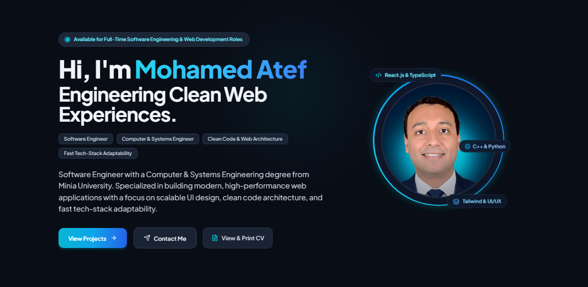

# 🚀 Mohamed Atef — Modern Developer Portfolio

<p align="center">
  
</p>

<p align="center">
  <strong>A high-performance, bilingual (English & Arabic), responsive single-page web portfolio built with React 19, Vite, and Tailwind CSS.</strong>
</p>

<p align="center">
  
  
  
  
  
  
</p>

---

## 📖 Table of Contents

- [Overview](#-overview)
- [Core Philosophy & Architecture](#-core-philosophy--architecture)
- [Key Features](#-key-features)
- [Tech Stack](#-tech-stack)
- [Project Directory Structure](#-project-directory-structure)
- [Getting Started](#-getting-started)
  - [Prerequisites](#prerequisites)
  - [Installation](#installation)
  - [Development Server](#development-server)
  - [Production Build](#production-build)
  - [Preview Production Build](#preview-production-build)
- [Customization Guide](#-customization-guide)
  - [Editing Content (Bilingual)](#editing-content-bilingual)
  - [Updating Profile Image & Assets](#updating-profile-image--assets)
  - [Modifying Colors & Themes](#modifying-colors--themes)
- [Performance Engineering](#-performance-engineering)
- [Author & Connect](#-author--connect)

---

## 🌟 Overview

This project is a personal portfolio and interactive digital resume engineered for **Mohamed Atef** (Software Engineer & Computer & Systems Engineering Graduate from Minia University). 

Designed from the ground up to reflect modern frontend engineering standards, it delivers a rich, fluid user experience with:
- **True Bilingualism**: Instant switching between English and Arabic with bidirectional layout adaptation (`dir="ltr"` / `dir="rtl"`).
- **Anti-Flicker (Zero-FOUC) Theme Engine**: Seamless Light and Dark mode transitions without flash-of-unstyled-content on page reload.
- **Hardware-Accelerated UI**: Silky smooth 60–120 FPS scrolling using `IntersectionObserver` and GPU-optimized radial gradients.
- **Data-Driven Decoupling**: All UI text, projects, skills, education, and translations are strictly isolated in a centralized data file (`portfolioData.js`).

---

## 🧠 Core Philosophy & Architecture

1. **Separation of Presentation & Data**:
   Components are pure presentation modules. Adding new projects, skills, or updating contact details requires zero modifications to JSX components—everything flows from `src/data/portfolioData.js`.
2. **Clean Component Hierarchy**:
   Every section (Hero, About, Skills, Projects, Education, Contact, Sidebar) is self-contained, modular, and typed for readability and long-term maintainability.
3. **RTL-First Compatibility**:
   Built using CSS logical properties (`start`, `end`, `ms-*`, `me-*`, `ps-*`, `pe-*`) to guarantee flawless bidirectional rendering without hardcoded spatial biases.
4. **Performance & Resource Economy**:
   Eliminated CPU layout thrashing and heavy GPU shader bottlenecks by leveraging browser-native APIs (`IntersectionObserver`, `requestAnimationFrame`, CSS hardware layers).

---

## ✨ Key Features

### 🌐 1. Complete Bilingual & RTL/LTR Engine
- **One-Click Switcher**: Toggle effortlessly between **English** and **العربية** directly from the sidebar.
- **Dynamic Directionality**: Automatically sets `document.documentElement.dir` (`rtl` or `ltr`) and `lang`.
- **Intelligent Typography**: Seamlessly switches font pairings—**Plus Jakarta Sans** for Latin text and **Cairo** for Arabic script.
- **Preserved Technical Terms**: Industry-standard technologies (React.js, Tailwind CSS, JavaScript, C++, Python, MySQL, Git, Docker, NEFREX) remain in their standard technical notation in both languages.
- **Persistent Preferences**: Stores the chosen language in `localStorage ('portfolio-lang')` for instant restoration upon reload.

### 🌓 2. Zero-FOUC Dark & Light Mode
- **Early Blocking Script**: Embedded inline in `<head>` to detect system color scheme (`prefers-color-scheme`) and cached user preference before any stylesheet or DOM node renders.
- **Midnight Slate Dark Palette**: Deep slate background (`#090d16`, `#0f172a`) paired with electric cyan and sky blue neon highlights (`#00f2fe`, `#4facfe`, `#38bdf8`).
- **Clean Slate Light Palette**: Pristine background (`#f8fafc`) with crisp slate surfaces and blue accents.
- **Smooth Color Interpolation**: Non-blocking CSS color transitions across all theme-aware surfaces.

### 📱 3. Animated Collapsible Sidebar Navigation
- **Desktop Dock**: Expands to full sidebar (`w-64`) or collapses to an icon-only rail (`w-20`) with smooth transitions.
- **Hover Tooltips**: Instant floating tooltips when hovered in collapsed mode.
- **Active Section Spy**: Automatically highlights the current visible section on the screen as you scroll.
- **Mobile Responsive Drawer**: Sticky top bar on mobile with hamburger toggle and backdrop-blur overlay drawer.

### 💼 4. Domain Showcase & Interactive Sections
- **Hero Section**: Pulsing availability badge, vibrant gradient headline, unbreakable name wrap, quick CTA buttons (*View Projects*, *Contact Me*, *View & Print CV*), and glowing avatar ring with floating tech badges.
- **About Me**: Academic overview (Computer & Systems Engineering at Minia University - Very Good 77.74%), core engineering principles, key metrics cards, soft skills grid, and language proficiencies.
- **Technical Skills**: Categorized competency matrices (*Frontend*, *Programming Languages & Backend*, *Tools & DevOps*) with visual progress bars and proficiency tags.
- **Projects Showcase**: Interactive tabbed category filter (*All*, *Featured*, *Web Applications*, *Academic/Full Stack*). Spotlights **NEFREX** (Minia University Faculty of Engineering governance platform) alongside responsive web solutions, complete with live preview and GitHub links.
- **Education & Specialized Courses**: Chronological academic credentials paired with completed certifications (*Full-Stack Web Development*, *Database Fundamentals*, *Cyber Security Attack Techniques*, *Data Analysis Using Excel*).
- **Interactive Contact Form**: Equal-height dual-column card layout, real-time client validation, focus glow states, direct email/phone links, and submission feedback.
- **Directional Back-to-Top**: Floats on the bottom-right in English (LTR) and automatically repositions to the bottom-left in Arabic (RTL) so it never collides with the sidebar.

---

## 🛠️ Tech Stack

| Domain | Technology | Purpose |
| :--- | :--- | :--- |
| **Framework** | [React 19](https://react.dev/) | Functional components, hooks, Context API |
| **Build Tool** | [Vite 8](https://vitejs.dev/) | Lightning-fast HMR and optimized production bundling |
| **Styling** | [Tailwind CSS 3.4](https://tailwindcss.com/) | Utility-first responsive design, custom gradients, dark mode |
| **Icons** | [Lucide React](https://lucide.dev/) | Consistent, lightweight SVG icon system |
| **Typography** | [Google Fonts](https://fonts.google.com/) | Plus Jakarta Sans (English) & Cairo (Arabic) |
| **CSS Tooling** | [PostCSS](https://postcss.org/) & [Autoprefixer](https://github.com/postcss/autoprefixer) | Automated vendor prefixing and modern CSS compilation |
| **Linter** | [Oxlint](https://oxc.rs/) | High-speed JavaScript/JSX code quality linting |

---

## 📁 Project Directory Structure

```text
portfolio-app/
├── public/
│   ├── favicon.svg               # SVG Brand favicon
│   ├── Mohamed_Atef_CV.pdf       # Printable / Downloadable CV document
│   ├── Portfolio.PNG             # Portfolio preview banner (English)
│   ├── Portfolio_AR.PNG          # Portfolio preview banner (Arabic)
│   ├── NEFREX.PNG                # NEFREX project showcase preview
│   └── ...                       # Project screenshots & avatar image
│
├── src/
│   ├── assets/                   # Static imported SVGs/assets
│   ├── components/               # Pure UI Presentation Components
│   │   ├── About.jsx             # Bio, stats grid, soft skills, languages
│   │   ├── BackToTop.jsx         # Direction-aware floating scroll button
│   │   ├── Contact.jsx           # Contact cards & interactive message form
│   │   ├── Education.jsx         # University degree & specialized courses
│   │   ├── Footer.jsx            # Footer links, copyright, and credits
│   │   ├── Hero.jsx              # Hero headline, CTA buttons, glowing avatar
│   │   ├── Icons.jsx             # Custom brand SVGs (GitHub, LinkedIn)
│   │   ├── LanguageToggle.jsx    # Arabic/English switcher button
│   │   ├── Projects.jsx          # Filterable project showcase grid
│   │   ├── Sidebar.jsx           # Animated collapsible navigation sidebar
│   │   ├── Skills.jsx            # Categorized skills matrix with progress bars
│   │   └── ThemeToggle.jsx       # Animated dark/light mode toggle
│   │
│   ├── context/
│   │   └── LanguageContext.jsx   # Global bilingual state & RTL management
│   │
│   ├── data/
│   │   └── portfolioData.js      # ⭐ Single Source of Truth (EN & AR Data)
│   │
│   ├── App.jsx                   # Application layout shell & theme manager
│   ├── index.css                 # Tailwind directives, custom scrollbars, GPU layers
│   └── main.jsx                  # React DOM root entry point
│
├── index.html                    # HTML shell, anti-FOUC blocking script, fonts
├── tailwind.config.js            # Custom color tokens, font families, keyframes
├── postcss.config.js             # PostCSS plugins config
├── vite.config.js                # Vite build and plugin settings
└── package.json                  # Dependencies and execution scripts
```

---

## 🚀 Getting Started

### Prerequisites
Make sure you have [Node.js](https://nodejs.org/) installed:
- **Node.js**: `v18.0.0` or higher
- **npm**: `v9.0.0` or higher

### Installation

1. **Clone the repository**:
   ```bash
   git clone https://github.com/M7md-atef/portfolio-app.git
   cd portfolio-app
   ```

2. **Install dependencies**:
   ```bash
   npm install
   ```

### Development Server

Start the local development server with Hot Module Replacement (HMR):

```bash
npm run dev
```

> **Windows PowerShell Note**: If you encounter an execution policy restriction (`npm.ps1 cannot be loaded`), run:
> ```powershell
> npm.cmd run dev
> ```
> Or permanently enable local scripts in PowerShell:
> ```powershell
> Set-ExecutionPolicy -Scope CurrentUser -ExecutionPolicy RemoteSigned
> ```

Open your browser and navigate to:
👉 **`http://localhost:5173`**

### Production Build

Compile and optimize the application for production deployment:

```bash
npm run build
```

This generates an ultra-compact, minified, and gzipped production bundle inside the `dist/` directory.

### Preview Production Build

Test the production bundle locally before deploying:

```bash
npm run preview
```

### Code Linting

Run Oxlint to check code quality:

```bash
npm run lint
```

---

## 🎨 Customization Guide

### Editing Content (Bilingual)
All content is centralized in **`src/data/portfolioData.js`**. The file exports a structured object with two main dictionaries:
- `portfolioContent.en` — English content
- `portfolioContent.ar` — Arabic content

```javascript
// src/data/portfolioData.js
export const portfolioContent = {
  en: {
    personalInfo: {
      name: "Your Name",
      title: "Your Title",
      email: "your.email@example.com",
      // ...
    },
    projects: [ /* your projects */ ],
    skills: [ /* your skills */ ],
  },
  ar: {
    personalInfo: {
      name: "اسمك بالعربية",
      title: "المسمى الوظيفي",
      // ...
    },
    // ...
  }
};
```

### Updating Profile Image & Assets
1. Place your photo inside the `public/` directory (e.g., `public/my-avatar.jpg`).
2. Update the `avatarUrl` property in `src/data/portfolioData.js`:
   ```javascript
   avatarUrl: "/my-avatar.jpg",
   ```

### Modifying Colors & Themes
Custom colors and theme tokens are defined in **`tailwind.config.js`**:
```javascript
// tailwind.config.js
theme: {
  extend: {
    colors: {
      brand: {
        cyan: '#00f2fe',
        sky: '#4facfe',
        baby: '#38bdf8',
        blue: '#0ea5e9',
        darkBlue: '#0284c7',
        midnight: '#090d16',
        slateDark: '#0f172a',
      }
    }
  }
}
```

---

## ⚡ Performance Engineering

This portfolio was rigorously optimized to achieve near-perfect Lighthouse scores and 60–120 FPS performance:

1. **IntersectionObserver Scroll Spy**:
   Instead of querying DOM elements on every scroll tick (`offsetTop` / `offsetHeight`), the application uses an asynchronous `IntersectionObserver`. This eliminates layout thrashing and reduces main-thread work by >90%.
2. **GPU Radial Gradients over Blur Filters**:
   Replaced computationally expensive CSS Gaussian blur filters (`blur(140px)` / `blur-3xl`) with lightweight mathematical CSS `radial-gradient()`, preventing GPU rasterization bottlenecks.
3. **Layer Promotion (`transform: translateZ(0)`)**:
   Glassmorphic cards run on dedicated hardware composite layers (`backface-visibility: hidden`), completely removing scroll repaints.
4. **Passive Event Listeners**:
   Scroll listeners for the *Back-to-Top* button utilize `{ passive: true }` and `requestAnimationFrame`, preventing scroll blocking.

---

## 👨‍💻 Author & Connect

**Mohamed Atef**  
*Software Engineer & Frontend Developer*  
*B.S. in Computer & Systems Engineering — Minia University*

- 📍 **Location:** Cairo, Egypt
- ✉️ **Email:** [mohamed110377@gmail.com](mailto:mohamed110377@gmail.com)
- 📞 **Phone / WhatsApp:** [+20 101 274 1752](tel:+201012741752)
- 💼 **LinkedIn:** [linkedin.com/in/mohamed-atef-eng](https://linkedin.com/in/mohamed-atef-eng)
- 🐙 **GitHub:** [github.com/M7md-atef](https://github.com/M7md-atef)

---

<p align="center">
  Crafted with ❤️ using <strong>React 19</strong> and <strong>Tailwind CSS</strong>.
</p>
